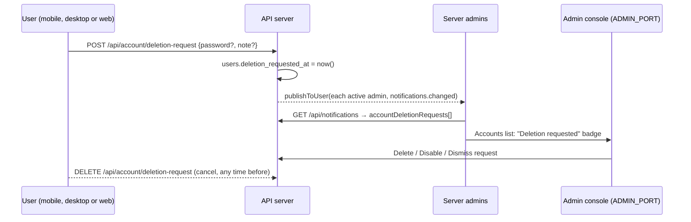
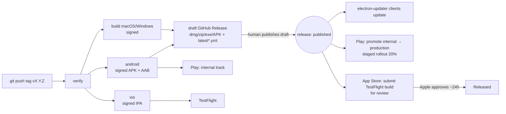

# PARA-40: Code signing and store release plan

> **Ticket:** PARA-40, *Make plan for code signing/deployment for Windows, Android, iOS*
> **Status:** Plan. Nothing in here has been built yet.
> **Written:** 2026-10-01, against `main` at `9ab5d89` (desktop and mobile at 0.17.3)

The ticket asks for three things:

1. A plan for code signing on Windows, Android and iOS: how to get the credentials, and how to use them in GitHub Actions.
2. What it takes to get the mobile apps into Google Play and the Apple App Store.
3. How to ship updates to those apps alongside the desktop releases.

---

## TL;DR

- **Most of the CI work is already done.** `.github/workflows/release.yml` already takes optional signing secrets for macOS, Android and iOS, and skips signing when they're missing. Android already builds a signed APK and an `.aab` once it has a keystore. iOS already archives an `.ipa` once it has a certificate and a provisioning profile. **What's mostly missing is accounts and credentials, not code.**
- **Windows is the exception.** The current note to "use `WIN_CSC_LINK`" (a `.pfx` file) no longer works. Since June 2023, CAs only issue code-signing keys on hardware or in a cloud HSM, so the key can't be exported. **Recommendation: Azure Trusted Signing** (Microsoft is renaming it *Artifact Signing*). It costs about $10 a month, and electron-builder 26 supports it directly through `win.azureSignOptions`.
- **Neither store will accept the app as it is today.** The fixes can stay small, along the lines of what Teams and Slack do (§5.1):
  - an in-app "Request deletion" in Settings, which notifies every server admin and flags the account in the admin console (PARA-42)
  - report a message to admins, and block a user (PARA-43)
  - a privacy policy URL (PARA-44)
  - a demo server and login for the reviewers (PARA-45)

  This product work is the **critical path**, not the signing.
- **Updates:** the tag push uploads the Android build to the Play *internal* track and the iOS build to *TestFlight* automatically. **Publishing the GitHub draft release** then triggers a new workflow that promotes the build to Play production (as a staged rollout) and submits it for App Store review. That keeps "publish the draft" as the one deliberate step, as it is for desktop today.

---

## 1. Current state (from the repo)

| Platform | Build in CI | Signing wired? | Credentials present? | Distribution today |
|---|---|---|---|---|
| macOS | `build` job, `macos-14`, dmg + zip | ✅ `CSC_LINK`, `CSC_KEY_PASSWORD`, `APPLE_ID`, `APPLE_APP_SPECIFIC_PASSWORD`, `APPLE_TEAM_ID` | Unknown. The README says Mac users have to update by hand until the builds are signed | GitHub Release + electron-updater |
| Windows | `build` job, `windows-latest`, NSIS x64 | ⚠️ Mentioned in a comment only (`WIN_CSC_LINK`). Nothing passes it in, and a `.pfx` can't be obtained any more | ❌ | GitHub Release + electron-updater (unsigned, SmartScreen warning) |
| Android | `android` job, Capacitor 8, Gradle | ✅ `ANDROID_KEYSTORE_BASE64`, `ANDROID_KEYSTORE_PASSWORD`, `ANDROID_KEY_ALIAS`, `ANDROID_KEY_PASSWORD` → `assembleRelease bundleRelease` | ❌ (debug-signed APK) | APK on the GitHub Release. The `.aab` is kept only as a workflow artifact |
| iOS | `ios` job, `macos-26`, only when `BUILD_IOS=true` | ✅ `IOS_CERTIFICATE_P12`, `IOS_CERTIFICATE_PASSWORD`, `IOS_PROVISIONING_PROFILE`, `APPLE_TEAM_ID`, `vars.IOS_EXPORT_METHOD` | ❌ | Simulator zip + `.ipa` as workflow artifacts. Nothing is uploaded anywhere |

Other things worth knowing:

- **Identifiers:** `com.paradocs.desktop` and `com.paradocs.mobile`. Both stores tie these to the app forever, so settle them before the first upload (see Decisions).
- **Version and build numbers:** both mobile platforms use `major*10000 + minor*100 + patch` (`apps/mobile/android/app/build.gradle`, and the `Version` step in `release.yml`). Both stores reject a build number they've already seen, so **re-running a release for a version that's already uploaded will fail at upload.** A hotfix always needs a version bump. That's fine, but it's worth knowing. Minor and patch numbers above 99 would collide.
- **The README release steps only bump the desktop version.** `verify` fails if `apps/mobile/package.json` doesn't match. The README should say `npm version X.Y.Z --workspace=@paradocs/desktop --workspace=@paradocs/mobile --no-git-tag-version`.
- **iOS project gaps:** no `PrivacyInfo.xcprivacy`, and no `ITSAppUsesNonExemptEncryption` key in `Info.plist`. The project uses `CODE_SIGN_STYLE = Automatic` with no `DEVELOPMENT_TEAM`, and CI overrides that to manual.
- **Android manifest:** `usesCleartextTraffic="true"` and `allowMixedContent` are there for HTTP servers on a LAN. Play allows both, but they have to be declared accurately in the Data safety form.
- **The mobile app bundles the web client** (`webDir: '../web/dist'`) and talks to whichever self-hosted server it's pointed at. Store releases and server upgrades will drift apart. See §6.4.

---

## 2. Windows code signing

### 2.1 Why the existing plan doesn't work

The comment in `release.yml` expects a certificate in `WIN_CSC_LINK` / `WIN_CSC_KEY_PASSWORD`. Since the CA/Browser Forum baseline change of 1 June 2023, every OV and EV code-signing certificate must keep its private key on a FIPS 140-2 Level 2 device: a USB token, an HSM, or a cloud HSM. No CA will hand you a `.pfx` to put in a GitHub secret. EV certificates also stopped getting instant SmartScreen reputation in 2024, so paying the EV premium buys little for this project.

### 2.2 Options

| Option | Cost (approx.) | CI fit | Notes |
|---|---|---|---|
| **Azure Trusted Signing / Artifact Signing** ✅ recommended | ~$9.99/mo (Basic, 5,000 signatures) | Native in electron-builder 26 (`azureSignOptions`). Auth is an Entra app registration (client secret, or OIDC federation) | Microsoft runs the certificate and renews it automatically, and the publisher name stays the same. **Eligibility is limited:** organizations need a verifiable history, and individual developers have been eligible in the US and Canada. Check eligibility before committing |
| Cloud HSM OV certificate (SSL.com eSigner, DigiCert KeyLocker, Certum SimplySign) | ~$130–$400/yr + per-signature or tool fees | Possible, through each vendor's signing tool and a custom `win.sign` hook in electron-builder | The fallback if Trusted Signing eligibility fails |
| USB token certificate | ~$200–$400/yr | ❌ Needs a self-hosted runner with the token plugged in | Not recommended |
| Stay unsigned | $0 | Already works | SmartScreen shows "Windows protected your PC" on every new download. Some corporate endpoint policies block it outright |

### 2.3 Steps to get the credentials (Trusted Signing)

1. Create an Azure subscription and a resource group (for example `paradocs-signing`).
2. Register the `Microsoft.CodeSigning` resource provider, then create a **Trusted Signing account** in a supported region (note its endpoint, e.g. `https://eus.codesigning.azure.net/`).
3. Give your own user the *Trusted Signing Identity Verifier* role, then submit **identity validation** (Public Trust; organization or individual). This takes from hours to a few business days. The verified name becomes the publisher users see.
4. Create a **certificate profile** of type *Public Trust* tied to that identity.
5. Create an **Entra ID app registration** (service principal) for CI and give it the *Trusted Signing Certificate Profile Signer* role on the account.
6. Prefer **OIDC federated credentials** for the GitHub repo, restricted to `refs/tags/v*` or a `release` environment, over a client secret. If you use a secret, put its expiry in the renewal calendar (§7).

### 2.4 GitHub Actions changes

`apps/desktop/electron-builder.yml`:

```yaml
win:
  # ...existing...
  azureSignOptions:
    publisherName: "<exact CN from the validated identity>"
    endpoint: https://eus.codesigning.azure.net/
    codeSigningAccountName: paradocs-signing
    certificateProfileName: paradocs-public
```

This needs one caveat handled: when `azureSignOptions` is present, electron-builder tries to sign and fails if there are no Azure credentials. Forks and local builds would then break. Keep the "sign only when credentials exist" pattern by **adding the block at build time** instead of committing it. One way is a `--config.win.azureSignOptions.*` override on the command line. Another is a small `electron-builder.sign.yml` that `extends` the base config and is used only when the secrets are present.

`release.yml`, in the `build` job, Windows only:

```yaml
- name: Configure Windows signing
  if: runner.os == 'Windows'
  shell: bash
  env:
    AZ_TENANT: ${{ secrets.AZURE_TENANT_ID }}
    AZ_CLIENT: ${{ secrets.AZURE_CLIENT_ID }}
    AZ_SECRET: ${{ secrets.AZURE_CLIENT_SECRET }}
  run: |
    if [ -z "$AZ_TENANT" ] || [ -z "$AZ_CLIENT" ] || [ -z "$AZ_SECRET" ]; then
      echo "No Azure signing credentials; building unsigned."; exit 0
    fi
    {
      echo "AZURE_TENANT_ID=$AZ_TENANT"
      echo "AZURE_CLIENT_ID=$AZ_CLIENT"
      echo "AZURE_CLIENT_SECRET=$AZ_SECRET"
      echo "WIN_SIGN_CONFIG=--config electron-builder.sign.yml"
    } >> "$GITHUB_ENV"
```

The build step then runs `npx electron-builder ${{ matrix.flag }} $WIN_SIGN_CONFIG --publish never`. Update the comment above the macOS `Configure signing` step at the same time, since it currently mentions `WIN_CSC_LINK`.

**Auto-update effect:** electron-updater on Windows checks that a new installer's publisher matches the `publisherName` baked into the installed app. Today's unsigned installs carry no publisher name, so they will accept the first signed update. After that, **the publisher name must never change.** Trusted Signing's daily-rotating certificates keep the same subject, so this works. Moving to a different CA later, under a different legal name, would break auto-update for every installed client.

### 2.5 Optional later: Microsoft Store

The Microsoft Store can list the existing NSIS `.exe` (a Win32 app) or an MSIX that electron-builder produces (`target: appx`). The Store signs MSIX packages itself, which avoids the certificate entirely for Store users. This isn't needed for PARA-40, but it's a cheap follow-up once the account exists. The individual developer account is free.

---

## 3. Android signing and Google Play

### 3.1 Signing keys: one decision to make first

Google Play requires **Play App Signing** for new apps. Google holds the *app signing key* that end users see, and CI signs uploads with an *upload key*. If Google generates the app signing key, **the APK on the GitHub Release (signed with our key) and the Play build (signed with Google's key) have different signatures.** Android then refuses to install one over the other, so a user who sideloaded the APK can't switch to Play without uninstalling and losing local data.

**Recommendation:** generate **one** key ourselves and choose *"Use your own app signing key"* (Export and upload a key from Java keystore) when setting up Play App Signing. The GitHub APK and the Play build then carry the same signature and can be installed over each other. CI signs both with the same key it already uses.

If you'd rather follow Google's guidance to keep the upload key separate, CI needs both keys anyway (one for the GitHub APK, one for Play uploads), and that gains nothing here.

### 3.2 Steps to get the credentials

1. **Generate the keystore** (once, on a trusted machine):
   ```bash
   keytool -genkeypair -v -keystore paradocs-release.jks -alias paradocs \
     -keyalg RSA -keysize 4096 -validity 10000 \
     -dname "CN=ParaDOCs, O=<org>, C=<country>"
   ```
2. **Back it up offline** (a password manager attachment plus an offline copy). Losing it means sideloaded installs can never be updated again. On Play, the upload key can be reset, but the app signing key cannot.
3. Add the GitHub secrets the workflow already reads:
   - `ANDROID_KEYSTORE_BASE64` = `base64 -i paradocs-release.jks`
   - `ANDROID_KEYSTORE_PASSWORD`, `ANDROID_KEY_ALIAS` (`paradocs`), `ANDROID_KEY_PASSWORD`

   **No workflow change is needed.** The next tag produces a release-signed APK and an AAB.

### 3.3 Getting onto Google Play

1. **Create a Google Play Console developer account** ($25 one-time) and verify your identity.
   - An **organization** account needs a D-U-N-S number (free, takes days to weeks) and can publish to production right away.
   - A **personal** account created after November 2023 must first run a **closed test with at least 12 opted-in testers for 14 consecutive days** before it can apply for production access. Plan around this; it's the longest lead time on the Android side.
2. **Create the app** in the Console under `com.paradocs.mobile` (the ID is permanent).
3. **Enroll in Play App Signing** with the key from §3.2 (export it with Google's PEPK tool when asked).
4. **Upload the first AAB by hand** to the Internal testing track. The Play Developer API can't create the first release of a new app.
5. Fill in the store listing and the policy declarations:
   - Short and full description, 512×512 icon, 1024×500 feature graphic, phone screenshots (and tablet ones if you want tablet visibility).
   - **Privacy policy URL** (required: the app records audio, uses the camera, and collects account data).
   - **Data safety form** (account info, messages, photos, audio, files; data encrypted in transit *depends on the server*, so be honest that HTTP servers are allowed).
   - Content rating questionnaire (user-generated content, chat → expect Teen or similar).
   - Target audience (not children).
   - **App access:** reviewer instructions with a **demo server URL and a test account** (§5).
   - **Account deletion:** an in-app path *and* a web URL (§5).
   - Declarations for `RECORD_AUDIO` and `CAMERA`, plus any foreground service types if added later.
6. **Target API level:** Play requires new apps and updates to target an API level from the last year. `targetSdkVersion = 36` meets the August 2026 requirement. Recheck every August.

### 3.4 Uploading from CI

1. In Google Cloud, create a **service account** and a JSON key. Invite it in Play Console under *Users and permissions*, scoped to this app, with *Release to testing tracks* (and *Release to production* for the promotion workflow in §6).
2. Add the secret `PLAY_SERVICE_ACCOUNT_JSON`.
3. Add a step to the `android` job (tag pushes only, never `workflow_dispatch` from `main`):
   ```yaml
   # Job-level env: PLAY_JSON: ${{ secrets.PLAY_SERVICE_ACCOUNT_JSON }}
   - name: Upload to Play internal track
     if: startsWith(github.ref, 'refs/tags/v') && env.ANDROID_KEYSTORE_PATH != '' && env.PLAY_JSON != ''
     uses: r0adkll/upload-google-play@v1
     with:
       serviceAccountJsonPlainText: ${{ secrets.PLAY_SERVICE_ACCOUNT_JSON }}
       packageName: com.paradocs.mobile
       releaseFiles: mobile-release/*.aab
       track: internal
       status: completed
   ```
   (A step's `if:` can't read `secrets` directly, so the secret goes through job-level `env`.) `fastlane supply` is an equivalent alternative if you'd rather use one tool for both stores.

### 3.5 Android developer verification (sideloaded APK)

Google is rolling out **developer verification for all apps installed on certified Android devices, including sideloaded ones**. Enforcement started in September 2026 in Brazil, Indonesia, Singapore and Thailand, and expands worldwide in 2027. The GitHub APK will eventually need `com.paradocs.mobile` and its signing key registered to a verified developer. A Play developer account covers the identity part; the package and key still need registering. **Check Google's current guidance when setting up the Play account**, because the details were still changing when this was written.

---

## 4. iOS signing and the App Store

### 4.1 Apple Developer Program

- **$99/yr.** The same membership also covers macOS Developer ID signing and notarization, so if macOS signing is already set up, use that team (`APPLE_TEAM_ID` is shared).
- An **organization** enrollment needs a D-U-N-S number and shows the legal entity as the seller. An **individual** enrollment shows your personal name on the App Store. Decide before enrolling, because moving from individual to organization is a support-ticket process.

### 4.2 Steps to get the credentials

Two ways to do it. **Recommendation: B**, because it removes the yearly certificate and profile rotation.

**A. Manual (what `release.yml` expects today)**

1. In *Certificates, Identifiers & Profiles*, register the **App ID** `com.paradocs.mobile` with no extra capabilities. Add Push Notifications or Associated Domains later only if they're needed.
2. Create an **Apple Distribution** certificate (CSR from Keychain Access), export it as `.p12` with a password → `IOS_CERTIFICATE_P12` (base64) and `IOS_CERTIFICATE_PASSWORD`.
3. Create an **App Store Connect** provisioning profile for the App ID with that certificate → `IOS_PROVISIONING_PROFILE` (base64).
4. Both expire after one year. Put them in the renewal calendar.

**B. App Store Connect API key + cloud-managed signing (recommended)**

1. In App Store Connect → *Users and Access* → *Integrations*, create a **Team API key** with the *App Manager* role. Download the `.p8` (you can only download it once).
2. Secrets: `ASC_KEY_ID`, `ASC_ISSUER_ID`, `ASC_KEY_P8` (base64).
3. In the `Archive and export` step, replace the manual identity and profile arguments with `-allowProvisioningUpdates -authenticationKeyPath … -authenticationKeyID … -authenticationKeyIssuerID …` and `CODE_SIGN_STYLE=Automatic DEVELOPMENT_TEAM=$APPLE_TEAM_ID`. Xcode then fetches or creates the cloud-managed distribution certificate and the profile on every run. The keychain and profile setup in `Configure signing` can go.
4. **The same key** uploads to TestFlight, submits for review (§6), **and can notarize macOS builds**. electron-builder accepts `APPLE_API_KEY`, `APPLE_API_KEY_ID`, `APPLE_API_ISSUER` in place of the Apple ID and app-specific password. One credential then covers all of Apple.

### 4.3 Project changes needed before the first upload

- **`ios/App/App/PrivacyInfo.xcprivacy`**: the privacy manifest. App Store Connect flags uploads that use "required-reason" APIs without one. Capacitor uses `UserDefaults` (reason `CA92.1`). Declare the collected data types (they should match the Play Data safety form) and `NSPrivacyTracking = false`.
- **`ITSAppUsesNonExemptEncryption = false`** in `Info.plist`. The app only uses standard HTTPS/TLS, so this skips the export-compliance question on every build.
- **App icon:** a 1024×1024 marketing icon in `Assets.xcassets` with no alpha channel.
- **Set `BUILD_IOS=true`** as a repository variable once the secrets exist.

### 4.4 Getting onto the App Store

1. In App Store Connect, **create the app record**: bundle ID `com.paradocs.mobile`, SKU, primary language, name (it has to be unique on the store; check that "ParaDOCs" is free).
2. Fill in the listing: description, keywords, support URL, **privacy policy URL**, screenshots (6.9" iPhone required; iPad too if iPad is supported, which the Capacitor default allows), age rating, category (Productivity).
3. **App Privacy** "nutrition label": the same data types as the privacy manifest.
4. **App Review information:** a demo server URL and a test account, plus a note that ParaDOCs is a client for self-hosted servers (§5).
5. The first build goes to **TestFlight** internal testers (no review). External TestFlight testers need a light Beta App Review.
6. Submit version 1.0 for review.

### 4.5 Uploading from CI

Add steps to the `ios` job after `Archive and export` (tag pushes only):

```yaml
- name: Upload to TestFlight
  if: steps.signing.outputs.enabled == 'true' && startsWith(github.ref, 'refs/tags/v')
  run: |
    mkdir -p ~/.appstoreconnect/private_keys
    echo "$ASC_KEY_P8" | base64 --decode > ~/.appstoreconnect/private_keys/AuthKey_$ASC_KEY_ID.p8
    xcrun altool --upload-app -t ios -f "ParaDOCs-$VERSION-ios.ipa" \
      --apiKey "$ASC_KEY_ID" --apiIssuer "$ASC_ISSUER_ID"
```

(`apple-actions/upload-testflight-build` or `fastlane pilot` do the same job.) Builds take about 5–30 minutes to process after upload before testers can install them.

---

## 5. Store blockers in the app itself (critical path)

Both stores review the *client*. They don't care that the server is self-hosted, and today's app would very likely be rejected for these reasons:

| # | Requirement | Apple | Google | Current state | Work |
|---|---|---|---|---|---|
| 1 | **Account deletion** for apps that let people create accounts | Guideline 5.1.1(v) | Account deletion policy (in-app path **and** a web URL) | Only an admin can delete accounts (`apps/web/src/admin/AdminApp.tsx:885`). `AuthScreen.tsx` offers registration whenever the server allows it | **PARA-42:** a native "Request deletion" in Settings → Account, with cancel. It notifies every active server admin through in-app notifications and adds a "Deletion requested" badge, filter and delete/disable/dismiss actions in the admin accounts list. A public `/account/delete` page shows the same form, for Google Play's web URL (see §5.2) |
| 2 | **UGC moderation:** report content, block users, publisher contact info | Guideline 1.2 | User-generated content policy | No report or block features found | **PARA-43 (minimum):** report a chat message to workspace admins through notifications, block a user (stored on the server), and a line in the listing and policy saying the server operator moderates |
| 3 | **Privacy policy** reachable from the listing and the app | Required | Required | None | **PARA-44:** a static page, e.g. GitHub Pages or the project site. Explain that data lives on the server the user picks, and that the app itself collects nothing |
| 4 | **A working demo for reviewers** | Guideline 2.1 (app completeness) | App access declaration | The app shows a server picker on first launch | **PARA-45:** run a long-lived **demo server** with a reviewer account and sample content. Keep it running and on a compatible version for as long as the apps are listed |
| 5 | **Minimum functionality** (no "just a website" wrappers) | Guideline 4.2 | — | A Capacitor shell around the web client, with native back handling, SSO via the system browser and media permissions | Probably fine. Make sure the listing shows real features (documents, sheets, chat, voice). Push notifications would strengthen the case |
| 6 | Sign in with Apple | Guideline 4.8 | — | Email and password, plus OIDC to providers the server operator configures | Exempt as it stands (the operator's own enterprise/education identity provider). Revisit if a built-in Google or Facebook login is ever added |

Items 1–4 are tracked as PARA-42 to PARA-45. They block both store submissions no matter how signing goes.

### 5.1 Why the minimum versions should be enough (how Teams and Slack handle this)

Workplace chat apps don't avoid these rules. They meet them in ways that fit a workplace product:

- **Account deletion.** Both stores' rules apply to apps that *let users create an account*. A Teams work account is created by the company's admin in Entra ID, and the app only signs people in. Where accounts can be created by users (personal Teams, Slack), the in-app "delete" opens a web page where deletion is completed, and Apple explicitly allows a direct link like that. ParaDOCs goes a step further and puts the request in the app itself (§5.2), so registration can stay available in the mobile app.
- **Moderation.** Guideline 1.2 is aimed at consumer social apps. Reviewers generally accept admin moderation for workplace tools, but Teams still ships "Report a concern" on messages. **ParaDOCs shouldn't rely on the workplace argument alone.** A client for self-hosted servers looks more like Element than Slack, and Element was briefly pulled from Google Play in 2021 over content on a server it connected to. Report and block cost little and remove the most likely rejection reason.
- **Privacy policy and demo account.** Nobody gets out of these. Teams and Slack host their own service, so giving reviewers an account is trivial for them. A self-hosted client needs a demo server instead.

The underlying difference: Microsoft and Slack *are* the operator, with terms of service, trust-and-safety teams and established relationships with app review. ParaDOCs is a client for servers we don't control, so the cheap features above are a better bet than arguing for exemptions.

### 5.2 Account deletion requests (PARA-42)

The user starts the deletion inside the app, and a server admin completes it. It goes through the operator because the existing admin delete (`DELETE /users/:id` in `apps/api/src/admin/routes.ts`) has to decide what happens to shared workspaces. It already refuses when the account created, or is the only owner of, a workspace other people use.



| Layer | Change |
|---|---|
| Database | Migration `0040`: `users.deletion_requested_at timestamptz`, `users.deletion_request_note text` |
| User API | `POST` / `DELETE /api/account/deletion-request`. Re-checks the password with the existing `confirmPassword` (skipped for SSO-only accounts). The `User` object gains `deletionRequestedAt` |
| Notifications | `Notifications.accountDeletionRequests?` (optional, so older servers still parse), filled only for `is_server_admin` accounts. A row in `NotificationsMenu` that counts towards the badge and stays until the request is handled. `connectionApi.notificationsFor` in the desktop app parses the new field. There's no email; the server has no mail sender |
| Admin console | `AdminUser.deletionRequestedAt` and `deletionRequestNote`. A danger-tone **Deletion requested** badge, flagged accounts sorted first, a filter. Account detail shows the note, with **Delete** (existing), **Disable** (existing) and **Dismiss request** (new) |
| App UI | A "Delete account" danger section in Settings → Account (`SettingsDialog.tsx`). It shows a pending state with **Cancel request**, and is hidden for the desktop app's local workspaces |
| Web URL | `/account/delete`, served by the web client. It explains the process and shows the same form once signed in. This URL goes in Google Play's account deletion field and in the privacy policy |

**Review risk:** Apple wants a deletion that users can start without contacting anyone, and expects you to say how long it takes. The in-app text and the review notes should say that the request goes to the operator of the user's server, who controls the data. The fallback if a reviewer objects is a server setting, *Delete accounts automatically when requested*. It would run the existing delete straight away whenever it isn't blocked by shared workspaces.

---

## 6. Shipping mobile updates alongside desktop

### 6.1 Target flow



**Why:** the deliberate step in `release.yml` today is publishing the GitHub draft. Hooking the store promotion onto that same event keeps one decision point. While the draft is unpublished, team members can test the exact store binaries on Play internal testing and TestFlight.

### 6.2 New workflow: `.github/workflows/promote-mobile.yml`

```yaml
on:
  release:
    types: [published]
  workflow_dispatch:
    inputs:
      version: { required: true }
```

- **Play job:** promote the build with versionCode `f(version)` from `internal` to `production` with `userFraction: 0.2`, using the Play Developer API (`fastlane supply --track internal --track_promote_to production --rollout 0.2`, or a short script). Raise the rollout to 100% by hand in the Console, or with a second `workflow_dispatch`.
- **iOS job:** create the App Store version `X.Y.Z` if it doesn't exist, attach the TestFlight build, fill in "What's New" from the GitHub release body, and submit for review (`fastlane deliver --submit_for_review --automatic_release --skip_binary_upload --build_number …`, or the App Store Connect API directly).
- **Gotcha:** `release: published` fires only when a *person* (or a PAT/App token) publishes the release. A release published with `GITHUB_TOKEN` does not trigger workflows. That's fine, because publishing is manual today.
- **Release notes:** the GitHub release body becomes the store "What's New" text. Play allows 500 characters per language, so truncate or keep a short `## Mobile` section in the notes.

### 6.3 What "alongside" can't mean

- **Apple review takes time.** iOS will usually go live 12–48 hours after desktop, and a rejection can hold it back longer. `--automatic_release` makes it go live as soon as it's approved. Use manual release instead if you want iOS and Android to appear on the same day.
- **Users choose when to update.** Stores roll out updates on their own schedules. Nothing like electron-updater's "restart to update" exists for store builds.
- **The sideloaded APK has no updater.** Options are (a) point Android users at Play, (b) document Obtainium (it reads GitHub releases), or (c) add a "new version available" banner that checks the GitHub Releases API, shown **only** in non-Play builds. A Gradle build flag can mark which is which. Play policy forbids self-updating, so the banner must never appear in the Play build.

### 6.4 Client and server version drift (new risk once the apps are in stores)

Desktop clients and self-hosted servers already drift apart, but stores make it worse: a user can have mobile 0.20 against a server still on 0.17, or the other way round. `/api/health` already returns `version` (`apps/api/src/app.ts:99`). Recommended follow-up:

- The server adds `minClientVersion` to `/api/health`. The client defines its own `MIN_SERVER_VERSION`.
- `ServerPicker` and app start-up compare the two and show "This server needs a newer app" or "This server is too old for this app; ask your admin to upgrade" instead of failing in confusing ways.
- Treat API changes as additive where possible, since mobile apps can't be force-upgraded quickly.

---

## 7. Secrets, environments and renewals

**Put every signing and store secret in a GitHub Environment** (e.g. `release`) that only accepts deployments from `v*` tags. Optionally require a reviewer. Then a `workflow_dispatch` on a branch, or a pull request, can never read signing material. Add `environment: release` to the `build`, `android`, `ios` and `promote-*` jobs.

| Secret / variable | Used by | Source | Expires / renews |
|---|---|---|---|
| `CSC_LINK`, `CSC_KEY_PASSWORD` | macOS | Developer ID Application `.p12` | 5 yrs |
| `APPLE_TEAM_ID` | macOS, iOS | Developer account | — |
| `APPLE_ID`, `APPLE_APP_SPECIFIC_PASSWORD` | macOS notarization | appleid.apple.com | Replace with the ASC API key (§4.2 B) |
| `ASC_KEY_ID`, `ASC_ISSUER_ID`, `ASC_KEY_P8` | iOS signing and upload, macOS notarization, promotion | App Store Connect | No expiry. Revoke if leaked |
| `IOS_CERTIFICATE_P12`, `IOS_CERTIFICATE_PASSWORD`, `IOS_PROVISIONING_PROFILE` | iOS (manual path only) | Developer portal | **1 yr** |
| `vars.BUILD_IOS`, `vars.IOS_EXPORT_METHOD` | iOS | — | — |
| `AZURE_TENANT_ID`, `AZURE_CLIENT_ID`, `AZURE_CLIENT_SECRET` | Windows | Entra app registration | Client secret max 2 yrs (none with OIDC) |
| `ANDROID_KEYSTORE_BASE64`, `ANDROID_KEYSTORE_PASSWORD`, `ANDROID_KEY_ALIAS`, `ANDROID_KEY_PASSWORD` | Android | `keytool` | ~27 yrs. **Never lose it** |
| `PLAY_SERVICE_ACCOUNT_JSON` | Android upload and promotion | Google Cloud | Rotate yearly |
| Apple Developer Program | everything Apple | — | **Yearly, $99** |
| Azure subscription | Windows | — | Monthly billing |

Keep the offline originals (the `.jks`, the `.p8`, the `.p12`s and their passwords) in a shared password manager vault, not only in GitHub secrets. GitHub secrets can't be read back.

---

## 8. Phased plan

Steps that only take a credential are marked 🔑, CI changes 🛠, and app or product work 📦.

**Phase 0: decisions and accounts (start now; these have the longest lead times)**
1. Decide whether to publish as an organization or an individual (affects Apple, Google and Azure eligibility). If an organization, request a **D-U-N-S number**.
2. 🔑 Enroll in the Apple Developer Program, or confirm the existing team.
3. 🔑 Create a Google Play Console account. If it's personal, **recruit 12+ closed testers now** (14-day clock).
4. 🔑 Create the Azure subscription and start **Trusted Signing identity validation**.

**Phase 1: signing everywhere (about 1–2 days of CI work once the credentials exist)**
5. 🔑 Generate the Android keystore and add the 4 secrets. The next tag gives a signed APK and AAB with no code change.
6. 🔑🛠 Create the ASC API key. Switch iOS to cloud-managed signing (§4.2 B), add `PrivacyInfo.xcprivacy` and `ITSAppUsesNonExemptEncryption`, set `BUILD_IOS=true`.
7. 🔑🛠 Windows Trusted Signing: conditional `azureSignOptions` and the `Configure Windows signing` step (§2.4).
8. 🛠 macOS: if not done already, add the Developer ID certificate and turn on notarization (preferably with the ASC API key).
9. 🛠 Move the signing secrets into a `release` environment. Fix the README version-bump command to bump both workspaces.

**Phase 2: store readiness (product work; separate tickets)**
10. 📦 **PARA-42:** in-app deletion request, server admin notification, "Deletion requested" flag in the admin accounts list, and a public `/account/delete` page.
11. 📦 **PARA-43:** report a chat message to admins, and block a user.
12. 📦 **PARA-44:** privacy policy page.
13. 📦 **PARA-45:** a long-lived demo server with a reviewer account.
14. 📦 Store listing assets: screenshots, feature graphic, descriptions.
15. 📦 *(Recommended)* Client and server version handshake (§6.4).

**Phase 3: first store releases**
16. Upload the first AAB by hand to Play internal and enroll in Play App Signing with our key. Run the closed test if required.
17. Fill in Play's Data safety, content rating and app access forms. Request production access.
18. Create the App Store Connect record, App Privacy label and review notes. TestFlight internal, then submit 1.0.

**Phase 4: automated updates**
19. 🛠 Add Play internal upload to the `android` job and TestFlight upload to the `ios` job (tag pushes only).
20. 🛠 Add `promote-mobile.yml` on `release: published` (§6.2).
21. 🛠 *(Optional)* Update banner for sideloaded APK builds only. Document Obtainium.
22. 📝 Update the README's Releasing section with the new flow and the renewal calendar.

---

## 9. Estimated costs

| Item | Cost |
|---|---|
| Apple Developer Program | $99/yr |
| Google Play Console | $25 one-time |
| Azure Trusted Signing (Basic) | ~$120/yr |
| D-U-N-S number | Free |
| Demo server | Whatever the smallest VPS costs (~$5–10/mo) |
| **Total** | **~$250/yr + $25 once + demo hosting** |

---

## 10. Open decisions for Michael

1. **Organization or individual publisher?** This drives D-U-N-S, the seller name on both stores, Play's 12-tester rule and Trusted Signing eligibility.
2. **Android key strategy:** recommended is a single self-generated key given to Play App Signing, so the GitHub APK and Play builds can be installed over each other.
3. **iOS release timing:** automatic release on approval (fastest) or a manual same-day release with Android.
4. **Keep the sideloaded APK on GitHub releases?** Recommended yes, for de-Googled devices and self-hosters. It brings the developer-verification and update-banner work in §3.5 and §6.3.
5. **Bundle IDs:** keep `com.paradocs.*`? Check that you control a `paradocs` domain or are happy with that namespace. It's permanent on both stores. (`com.paradoxhomefront.paradocs` would match the domain the ParaDOCs instance runs on.)
6. **Microsoft Store listing** (§2.5): in scope now or later?
